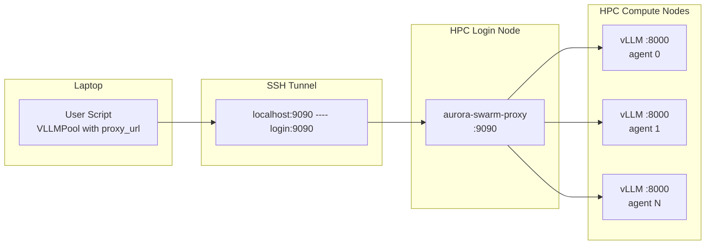
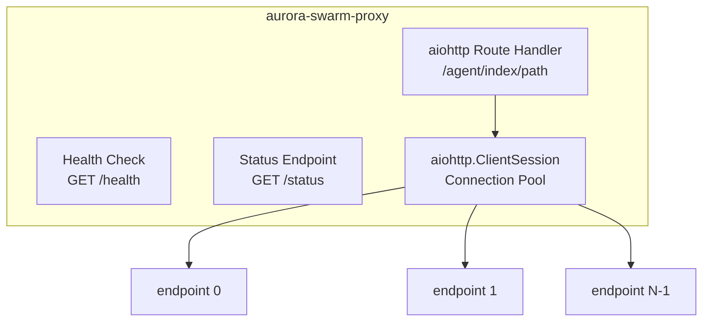
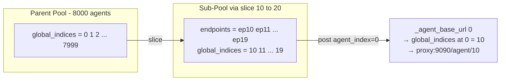
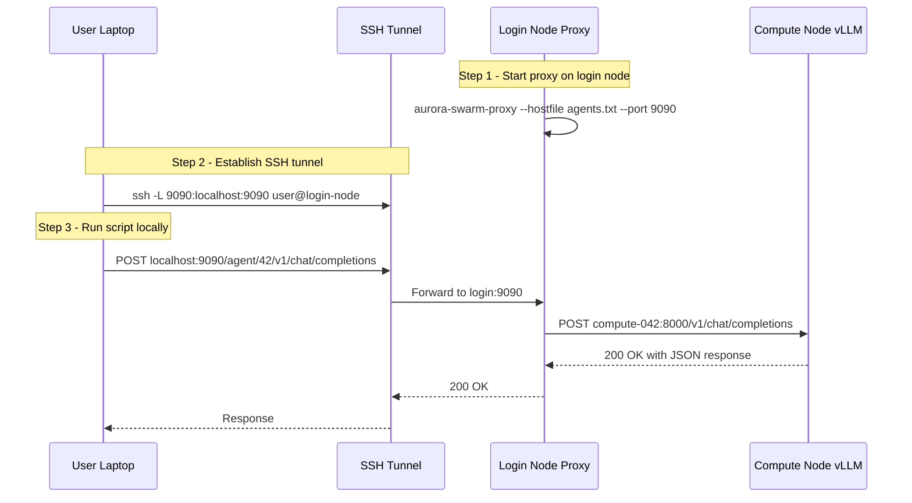

# Aurora-Swarm HTTP Reverse Proxy — Design Document

## 1. Overview

### 1.1 Problem Statement

Aurora-Swarm orchestrates large-scale LLM agent swarms on HPC compute nodes. Currently, user scripts must run directly on HPC login nodes because compute nodes are not reachable from external networks. Users want to develop and run scripts from their local laptops while still accessing all agent endpoints on compute nodes.

### 1.2 Solution

Deploy a **single-port HTTP reverse proxy** on the HPC login node. The proxy:

- Reads the same hostfile used by `AgentPool` / `VLLMPool`
- Exposes all agents through URL path-based routing on one port
- Allows users to reach all agents via a single SSH tunnel



### 1.3 Design Principles

- **Zero protocol change**: The proxy is a transparent HTTP forwarder; it does not interpret or transform request/response bodies.
- **Backward compatible**: Existing code running directly on login nodes works without modification. Proxy mode is opt-in via a new `proxy_url` parameter.
- **Minimal dependencies**: Uses `aiohttp` only (already a project dependency).
- **Single port**: All agents are multiplexed through one TCP port, requiring only one SSH tunnel.

---

## 2. Routing Mechanism

### 2.1 URL Path Prefix Scheme

The proxy uses URL path prefixes to route requests to the correct agent:

```
POST http://proxy:9090/agent/{index}/{downstream_path}
  → POST http://{endpoints[index].host}:{endpoints[index].port}/{downstream_path}
```

**Examples:**

| Client Request | Proxy Forwards To |
|---|---|
| `POST /agent/0/generate` | `POST http://compute-001:8000/generate` |
| `POST /agent/42/v1/chat/completions` | `POST http://compute-042:8000/v1/chat/completions` |
| `GET /agent/0/v1/models` | `GET http://compute-001:8000/v1/models` |

### 2.2 Why Path Prefix Over Headers

| Criterion | Path Prefix | HTTP Header |
|---|---|---|
| Debuggability with curl | ✅ Visible in URL | ❌ Requires `-H` flag |
| Browser testable | ✅ Yes | ❌ No |
| Proxy-agnostic clients | ✅ Standard URL | ❌ Custom header |
| URL cleanliness | Slightly longer URLs | ✅ Clean URLs |

Path prefix is chosen for transparency and ease of debugging at scale.

---

## 3. Proxy Server Design

### 3.1 Architecture



### 3.2 Components

#### 3.2.1 Route Handler

The core handler matches `/{agent_index}/{path:.*}` under the `/agent` prefix:

1. Extract `agent_index` from URL path
2. Validate index is within `[0, len(endpoints))`
3. Reconstruct downstream URL: `http://{host}:{port}/{remaining_path}`
4. Forward the request (method, headers, body) to the downstream endpoint
5. Stream the response back to the client

**Forwarded elements:**
- HTTP method (GET, POST)
- Request body (raw bytes, not parsed)
- `Content-Type` header
- Client-specified timeout (via `X-Timeout` header, optional)

**Not forwarded:**
- `Host` header (rewritten to downstream)
- `Connection` / hop-by-hop headers

#### 3.2.2 Health Check Endpoint

```
GET /health → 200 {"status": "ok", "agents": 8000, "uptime_seconds": 3600}
```

Used by SSH tunnel keepalive scripts and monitoring.

#### 3.2.3 Status Endpoint

```
GET /status → 200 {
    "agents": 8000,
    "endpoints": [
        {"index": 0, "host": "compute-001", "port": 8000, "tags": {"node": "aurora-0001"}},
        ...
    ]
}
```

Allows clients to discover the agent list without needing the hostfile locally.

### 3.3 Connection Pool Management

| Parameter | Value | Rationale |
|---|---|---|
| `TCPConnector.limit` | 2048 | Total open connections across all endpoints |
| `TCPConnector.limit_per_host` | 4 | Per-endpoint cap; LLM requests are long-lived, low concurrency per agent |
| `TCPConnector.ttl_dns_cache` | 300 | Cache DNS for 5 min; compute node IPs are stable |
| `TCPConnector.enable_cleanup_closed` | True | Clean up closed connections proactively |

The proxy creates **one** `aiohttp.ClientSession` at startup and reuses it for all forwarded requests.

### 3.4 Timeout Handling

The proxy supports two timeout mechanisms:

1. **Default timeout**: Configurable at proxy startup (e.g., `--timeout 600`). Applied to all forwarded requests.
2. **Per-request timeout**: Client can send `X-Timeout: 300` header to override the default for a specific request. The proxy uses `min(client_timeout, max_timeout)` to prevent abuse.

The proxy's own client timeout is set to match, ensuring the proxy does not time out before the downstream response arrives.

### 3.5 Error Handling

| Scenario | Proxy Response |
|---|---|
| Invalid agent index | `400 {"error": "agent index 9999 out of range [0, 8000)"}` |
| Downstream connection refused | `502 {"error": "cannot connect to compute-001:8000"}` |
| Downstream timeout | `504 {"error": "upstream timeout after 300s"}` |
| Downstream returns error | Forward as-is (transparent proxy) |

All errors are logged with timestamp, agent index, and downstream endpoint.

### 3.6 Logging

- **Startup**: Log hostfile path, number of endpoints, listen address
- **Per-request**: Log at DEBUG level: method, agent index, downstream URL, response status, latency
- **Errors**: Log at ERROR level with full exception details
- Use Python `logging` module with configurable level via `--log-level`

### 3.7 CLI Interface

```
aurora-swarm-proxy --hostfile agents.txt [OPTIONS]

Options:
  --hostfile PATH       Path to hostfile (required)
  --port INT            Listen port (default: 9090)
  --host STR            Listen address (default: 127.0.0.1)
  --timeout FLOAT       Default upstream timeout in seconds (default: 600)
  --max-timeout FLOAT   Maximum allowed per-request timeout (default: 1800)
  --connector-limit INT Total connection pool size (default: 2048)
  --log-level STR       Logging level (default: INFO)
```

**Note**: `--host` defaults to `127.0.0.1` (localhost only) for security. The proxy is intended to be accessed via SSH tunnel, not exposed to the network.

---

## 4. Client-Side Changes

### 4.1 Design Goal

Enable proxy mode with **minimal API surface change** and **full backward compatibility**. Existing code that runs on login nodes must work without modification.

### 4.2 New Parameter: `proxy_url`

Add an optional `proxy_url` parameter to `AgentPool.__init__` and `VLLMPool.__init__`:

```
AgentPool(endpoints, proxy_url=None, concurrency=512, ...)
VLLMPool(endpoints, proxy_url=None, model="...", ...)
```

- When `proxy_url` is `None` (default): direct mode, current behavior unchanged.
- When `proxy_url` is set (e.g., `"http://localhost:9090"`): all requests route through the proxy.

Also support environment variable `AURORA_SWARM_PROXY_URL` as fallback.

### 4.3 URL Construction Change

#### Current Implementation

In [`AgentPool.post()`](aurora_swarm/pool.py:138):
```python
ep = self._endpoints[agent_index]
# URL: f"{ep.url}/generate"  →  http://compute-001:8000/generate
```

In [`VLLMPool.post()`](aurora_swarm/vllm_pool.py:127):
```python
ep = self._endpoints[agent_index]
# URL: f"{ep.url}/v1/chat/completions"  →  http://compute-001:8000/v1/chat/completions
```

#### Proposed Change

Add a helper method `_agent_base_url(agent_index)` to `AgentPool`:

```
Direct mode:   _agent_base_url(i) → http://compute-001:8000
Proxy mode:    _agent_base_url(i) → http://localhost:9090/agent/42
```

Where `42` is the **global index** of the agent (its position in the original hostfile), not the local index within a sub-pool.

All URL construction changes from `f"{ep.url}/..."` to `f"{self._agent_base_url(agent_index)}/..."`.

### 4.4 Sub-Pool Global Index Tracking

**Problem**: Sub-pools created via [`by_tag()`](aurora_swarm/pool.py:106), [`sample()`](aurora_swarm/pool.py:111), [`select()`](aurora_swarm/pool.py:116), or [`slice()`](aurora_swarm/pool.py:121) re-index endpoints starting from 0. But the proxy needs the original hostfile index.

**Solution**: Add a `_global_indices: list[int]` field to `AgentPool`:

- Initialized as `list(range(len(endpoints)))` in `__init__`
- Sliced/filtered in parallel with `_endpoints` in [`_sub_pool()`](aurora_swarm/pool.py:125)
- Used by `_agent_base_url()` to map local index → global index



### 4.5 Backward Compatibility Matrix

| Usage | Before | After |
|---|---|---|
| Direct mode, no proxy_url | `AgentPool(eps)` | `AgentPool(eps)` — unchanged |
| Direct mode, explicit | — | `AgentPool(eps, proxy_url=None)` — same as above |
| Proxy mode | — | `AgentPool(eps, proxy_url="http://localhost:9090")` |
| Proxy via env var | — | `AURORA_SWARM_PROXY_URL=http://localhost:9090` |
| Sub-pool operations | `pool.slice(10, 20).post(0, ...)` | Works correctly in both modes |
| VLLMPool metadata fetch | `GET ep.url/v1/models` | `GET proxy/agent/0/v1/models` in proxy mode |

### 4.6 Changes to `_get_model_max_context`

[`VLLMPool._get_model_max_context()`](aurora_swarm/vllm_pool.py:88) currently fetches from `self._endpoints[0].url`. In proxy mode, it should use `self._agent_base_url(0)` instead. This is automatically handled by the URL construction refactor.

---

## 5. Deployment Flow

### 5.1 End-to-End Setup



### 5.2 Step-by-Step Commands

#### Step 1: Start proxy on HPC login node

```bash
# SSH into login node
ssh user@login-node

# Activate conda environment
conda activate aurora-swarm

# Start proxy (hostfile is already on login node from job submission)
aurora-swarm-proxy --hostfile /path/to/agents.txt --port 9090
```

Or run in background:

```bash
nohup aurora-swarm-proxy --hostfile /path/to/agents.txt --port 9090 \
    --log-level INFO > proxy.log 2>&1 &
```

#### Step 2: Establish SSH tunnel from laptop

```bash
ssh -N -L 9090:localhost:9090 user@login-node
```

Flags:
- `-N`: No remote command (tunnel only)
- `-L 9090:localhost:9090`: Forward local port 9090 to login node port 9090

#### Step 3: Run script locally

```python
from aurora_swarm import VLLMPool, parse_hostfile

# Parse the same hostfile (copy it locally or use /status endpoint)
endpoints = parse_hostfile("agents.txt")

# Create pool in proxy mode
pool = VLLMPool(
    endpoints,
    model="meta-llama/Llama-3.1-70B-Instruct",
    proxy_url="http://localhost:9090",
)

# Use exactly as before — all patterns work transparently
responses = await pool.send_all(prompts)
```

Or using environment variable:

```bash
export AURORA_SWARM_PROXY_URL=http://localhost:9090
python examples/scatter_gather_coli.py /data/batch_1/ --hostfile agents.txt
```

---

## 6. Performance Considerations

### 6.1 Scale Parameters

| Parameter | Value |
|---|---|
| Total agents | Up to 8,000 |
| Max concurrent requests | 512 (semaphore in AgentPool) |
| Typical request body size | 1–50 KB (JSON prompt) |
| Typical response body size | 1–20 KB (JSON completion) |
| Typical request latency | 5–60 seconds (LLM inference) |

### 6.2 Proxy Overhead Analysis

| Overhead Source | Impact | Mitigation |
|---|---|---|
| Extra network hop (laptop → login → compute) | +1–5 ms per request | Negligible vs. 5–60s inference time |
| SSH tunnel encryption | ~0.1 ms per request | Negligible |
| Proxy request parsing | ~0.01 ms per request | aiohttp is async, non-blocking |
| Memory for buffered bodies | ~50 KB × 512 = ~25 MB peak | Well within login node capacity |

**Conclusion**: The proxy adds < 0.1% overhead to end-to-end latency. The bottleneck remains LLM inference time on compute nodes.

### 6.3 Connection Pool Sizing

```
512 concurrent requests → at most 512 active TCP connections to compute nodes
8000 agents → average 0.064 concurrent connections per agent
```

The proxy's `TCPConnector(limit=2048)` provides ample headroom. The `limit_per_host=4` prevents any single agent from monopolizing connections.

### 6.4 Timeout Chain

Timeouts must be configured consistently across the chain:

```
Client timeout ≤ Proxy upstream timeout ≤ Proxy max timeout
```

| Component | Default Timeout | Configurable |
|---|---|---|
| VLLMPool (client) | 300s | `timeout` parameter |
| Proxy upstream | 600s | `--timeout` flag |
| Proxy max allowed | 1800s | `--max-timeout` flag |
| SSH tunnel | None (keepalive) | SSH config `ServerAliveInterval` |

Recommendation: Set proxy timeout ≥ client timeout to avoid premature proxy-side disconnects.

### 6.5 SSH Tunnel Stability

For long-running jobs, configure SSH keepalive:

```bash
ssh -N -L 9090:localhost:9090 \
    -o ServerAliveInterval=30 \
    -o ServerAliveCountMax=3 \
    user@login-node
```

This sends keepalive packets every 30 seconds and disconnects after 3 missed responses.

---

## 7. File Structure

### 7.1 New Files

```
aurora_swarm/
├── proxy.py          # Proxy server: aiohttp web app, route handler, health/status endpoints
├── cli.py            # CLI entry point: argument parsing, server startup
├── pool.py           # Modified: add proxy_url, _global_indices, _agent_base_url()
├── vllm_pool.py      # Modified: use _agent_base_url() for URL construction
├── hostfile.py       # Unchanged
└── __init__.py       # Updated exports
```

### 7.2 New File Descriptions

#### `aurora_swarm/proxy.py`

The proxy server module containing:
- `ProxyApp` class: wraps aiohttp web application
- `_handle_agent_request()`: core route handler for `/agent/{index}/{path:.*}`
- `_handle_health()`: health check handler
- `_handle_status()`: status/discovery handler
- `create_proxy_app()`: factory function to build the app from a hostfile

#### `aurora_swarm/cli.py`

CLI entry point containing:
- `main()`: argument parsing and server startup
- Registered as `aurora-swarm-proxy` console script

### 7.3 pyproject.toml Changes

```toml
[project.scripts]
aurora-swarm-proxy = "aurora_swarm.cli:main"

[project.optional-dependencies]
proxy = []  # No extra deps needed; aiohttp is already a core dependency
```

### 7.4 Modified Files Summary

| File | Change |
|---|---|
| [`aurora_swarm/pool.py`](aurora_swarm/pool.py) | Add `proxy_url` param, `_global_indices`, `_agent_base_url()` method; update `post()` and `_sub_pool()` |
| [`aurora_swarm/vllm_pool.py`](aurora_swarm/vllm_pool.py) | Update `post()` and `_get_model_max_context()` to use `_agent_base_url()` |
| [`aurora_swarm/__init__.py`](aurora_swarm/__init__.py) | Export `ProxyApp` or `create_proxy_app` |
| [`pyproject.toml`](pyproject.toml) | Add `[project.scripts]` entry |

---

## 8. Security Considerations

- **Proxy binds to localhost only** (`127.0.0.1`): Not exposed to the HPC network. Only accessible via SSH tunnel.
- **No authentication**: The SSH tunnel provides authentication. The proxy trusts all connections on localhost.
- **No TLS**: Traffic between proxy and compute nodes is on the internal HPC network (already trusted). Traffic between laptop and login node is encrypted by SSH.
- **Input validation**: Agent index is validated as an integer within bounds. Malformed requests return 400.

---

## 9. Future Extensions

These are **not** in scope for the initial implementation but are noted for future consideration:

- **WebSocket support**: For streaming token-by-token responses (SSE/WebSocket)
- **Agent health monitoring**: Proxy periodically pings agents and marks unhealthy ones
- **Load balancing**: Proxy-side round-robin or least-connections routing (currently client-side)
- **Multi-user support**: Rate limiting per SSH tunnel / API key
- **Metrics endpoint**: Prometheus-compatible `/metrics` for monitoring throughput and latency