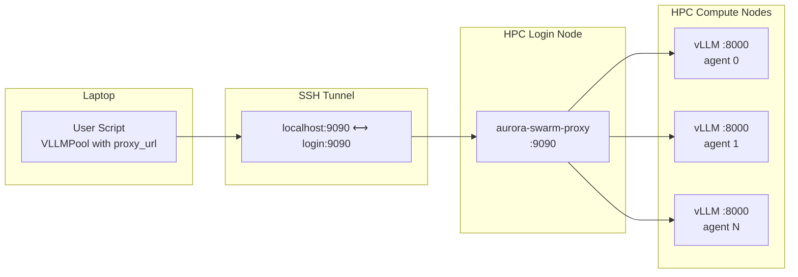

# Proxy Usage Guide

## Overview

Aurora-Swarm's HTTP reverse proxy allows you to access agent swarms running
on HPC compute nodes from your local laptop. Compute nodes on most HPC
clusters are not directly reachable from external networks. The proxy solves
this by multiplexing all agent endpoints behind a single TCP port on the HPC
login node, so you only need **one SSH tunnel** to reach every agent.

### Architecture



The proxy uses **path-prefix routing** — each agent is addressed by its index
in the hostfile:

| Client Request                          | Proxy Forwards To                                  |
| --------------------------------------- | -------------------------------------------------- |
| `POST /agent/0/v1/chat/completions`     | `POST http://compute-001:8000/v1/chat/completions`  |
| `GET  /agent/3/v1/models`               | `GET  http://compute-004:8000/v1/models`            |
| `POST /agent/42/generate`               | `POST http://compute-042:8000/generate`             |

## Prerequisites

Before using the proxy, make sure you have:

1. **Aurora-Swarm installed** on both the HPC login node and your local machine:

    ```bash
    # From PyPI
    pip install aurora-swarm

    # Or from source (editable install)
    pip install -e .
    ```

2. **SSH access** to the HPC login node.

3. **vLLM instances running** on the compute nodes. The proxy does not start
   or manage vLLM — it only forwards requests to already-running endpoints.

4. **A hostfile** listing the compute node endpoints. The hostfile uses
   tab-separated format with one agent per line:

    ```
    compute-001	8000
    compute-002	8000
    compute-003	8000	node=aurora-0003	role=worker
    ```

    Blank lines and lines starting with `#` are ignored.

## Starting the Proxy on the HPC Login Node

SSH into the login node and run:

```bash
# Basic usage
aurora-swarm-proxy --hostfile /path/to/hostfile

# Full options
aurora-swarm-proxy \
    --hostfile /path/to/hostfile \
    --host 0.0.0.0 \
    --port 9090 \
    --connector-limit 1024 \
    --timeout 300 \
    --log-level INFO
```

### CLI Parameters

| Parameter            | Short | Default     | Description                                                                                                          |
| -------------------- | ----- | ----------- | -------------------------------------------------------------------------------------------------------------------- |
| `--hostfile`         | `-f`  | *(required)* | Path to the hostfile listing agent endpoints. Falls back to the `AURORA_SWARM_HOSTFILE` environment variable.        |
| `--host`             |       | `0.0.0.0`   | Address to bind the proxy server to. Use `0.0.0.0` to accept connections from SSH tunnels.                           |
| `--port`             | `-p`  | `9090`      | TCP port to listen on.                                                                                               |
| `--connector-limit`  |       | `1024`      | Maximum number of simultaneous outbound connections to downstream agents.                                            |
| `--timeout`          | `-t`  | `300`       | Default upstream request timeout in seconds. Can be overridden per-request via the `X-Timeout` header.               |
| `--log-level`        |       | `INFO`      | Logging level. One of `DEBUG`, `INFO`, `WARNING`, `ERROR`, `CRITICAL`.                                               |

### Running in the Background

```bash
nohup aurora-swarm-proxy \
    --hostfile /path/to/hostfile \
    --port 9090 \
    --log-level INFO \
    > proxy.log 2>&1 &
```

### Using the Environment Variable

Instead of passing `--hostfile` every time, you can set:

```bash
export AURORA_SWARM_HOSTFILE=/path/to/hostfile
aurora-swarm-proxy
```

## Establishing the SSH Tunnel

From your local laptop, create an SSH tunnel that forwards a local port to
the proxy port on the login node:

```bash
# Interactive (stays in foreground)
ssh -L 9090:localhost:9090 user@hpc-login-node

# Background (tunnel only, no shell)
ssh -fNL 9090:localhost:9090 user@hpc-login-node
```

**Flags explained:**

- `-L 9090:localhost:9090` — Forward local port 9090 to port 9090 on the
  login node.
- `-f` — Run SSH in the background after authentication.
- `-N` — Do not execute a remote command (tunnel only).

### Keeping the Tunnel Alive

For long-running jobs, configure SSH keepalive to prevent the tunnel from
dropping:

```bash
ssh -fNL 9090:localhost:9090 \
    -o ServerAliveInterval=30 \
    -o ServerAliveCountMax=3 \
    user@hpc-login-node
```

Alternatively, use `autossh` for automatic reconnection:

```bash
autossh -M 0 -fNL 9090:localhost:9090 \
    -o ServerAliveInterval=30 \
    -o ServerAliveCountMax=3 \
    user@hpc-login-node
```

## Using the Proxy from Your Local Machine

Once the proxy is running and the SSH tunnel is established, you can access
the agent swarm from your local machine in several ways.

### Option 1: `proxy_url` Parameter

Pass `proxy_url` when creating a pool:

```python
from aurora_swarm import VLLMPool, parse_hostfile

endpoints = parse_hostfile("hostfile.txt")
pool = VLLMPool(
    endpoints=endpoints,
    model="meta-llama/Llama-3.1-70B-Instruct",
    proxy_url="http://localhost:9090",
)
```

All requests from this pool will be routed through the proxy. Sub-pools
created via `by_tag()`, `sample()`, `select()`, or `slice()` automatically
inherit the proxy configuration and correctly map local indices to global
hostfile indices.

### Option 2: Environment Variable

Set the `AURORA_SWARM_PROXY_URL` environment variable and your scripts
require no code changes:

```bash
export AURORA_SWARM_PROXY_URL=http://localhost:9090
python my_script.py
```

In your script, simply create the pool as usual — the proxy URL is picked up
automatically:

```python
pool = VLLMPool(
    endpoints=endpoints,
    model="meta-llama/Llama-3.1-70B-Instruct",
    # proxy_url is read from AURORA_SWARM_PROXY_URL
)
```

!!! note
    An explicit `proxy_url` parameter always takes priority over the
    environment variable.

### Option 3: Direct HTTP Requests (curl)

You can also interact with the proxy directly using `curl`, which is useful
for quick testing and debugging:

```bash
# Health check
curl http://localhost:9090/health
# → {"status": "ok"}

# View proxy status and agent list
curl http://localhost:9090/status
# → {"agents": 3, "uptime_seconds": 120.5, "endpoints": [...]}

# Query agent 0's model information
curl http://localhost:9090/agent/0/v1/models

# Send a chat completion request to agent 0
curl -X POST http://localhost:9090/agent/0/v1/chat/completions \
    -H "Content-Type: application/json" \
    -d '{
        "model": "meta-llama/Llama-3.1-70B-Instruct",
        "messages": [{"role": "user", "content": "Hello!"}],
        "max_tokens": 128
    }'
```

### Per-Request Timeout Override

You can override the proxy's default timeout for individual requests by
setting the `X-Timeout` header:

```bash
# Allow up to 600 seconds for a long-running request
curl -X POST http://localhost:9090/agent/0/v1/chat/completions \
    -H "Content-Type: application/json" \
    -H "X-Timeout: 600" \
    -d '{"model": "my-model", "messages": [{"role": "user", "content": "..."}]}'
```

## Complete Example

This example walks through the full workflow: starting the proxy, creating
the tunnel, and running a scatter-gather job from your laptop.

### Step 1: Prepare the Hostfile

On the HPC login node, create (or locate) a hostfile listing your vLLM
endpoints:

```bash
# Example: hostfile.txt
cat <<EOF > hostfile.txt
compute-001	8000
compute-002	8000
compute-003	8000
compute-004	8000
EOF
```

### Step 2: Start the Proxy on the Login Node

```bash
ssh user@hpc-login-node

# Activate your environment
conda activate aurora-swarm

# Start the proxy
aurora-swarm-proxy --hostfile hostfile.txt --port 9090
```

You should see output like:

```
2025-01-15 10:00:00 [INFO] aurora_swarm.proxy: Proxy started — listening on 0.0.0.0:9090 with 4 agent(s)
```

### Step 3: Open the SSH Tunnel (from your laptop)

In a new terminal on your laptop:

```bash
ssh -fNL 9090:localhost:9090 user@hpc-login-node
```

### Step 4: Verify Connectivity

```bash
curl http://localhost:9090/health
# → {"status": "ok"}

curl http://localhost:9090/status
# → {"agents": 4, "uptime_seconds": 42.0, "endpoints": [...]}
```

### Step 5: Run Your Script Locally

```python
import asyncio
from aurora_swarm import VLLMPool, parse_hostfile
from aurora_swarm.patterns.scatter_gather import scatter_gather

async def main():
    # Parse the same hostfile (copy it to your laptop, or create a matching one)
    endpoints = parse_hostfile("hostfile.txt")

    # Create pool with proxy routing
    async with VLLMPool(
        endpoints=endpoints,
        model="meta-llama/Llama-3.1-70B-Instruct",
        proxy_url="http://localhost:9090",
        max_tokens=512,
    ) as pool:
        prompts = [
            "What is the function of the lacZ gene in E. coli?",
            "Describe the role of sigma factor in bacterial transcription.",
            "What are the key virulence factors of Salmonella?",
            "Explain the SOS response in bacteria.",
        ]

        # Scatter prompts across agents and gather results
        responses = await scatter_gather(pool, prompts)

        for i, resp in enumerate(responses):
            print(f"--- Prompt {i} (agent {resp.agent_index}) ---")
            if resp.success:
                print(resp.text[:200], "...")
            else:
                print(f"Error: {resp.error}")

asyncio.run(main())
```

## Proxy Endpoints Reference

| Method | Path                        | Description                                      |
| ------ | --------------------------- | ------------------------------------------------ |
| GET    | `/health`                   | Health check. Returns `{"status": "ok"}`.        |
| GET    | `/status`                   | Agent list, count, and proxy uptime.             |
| *      | `/agent/{index}/{path:.*}`  | Forward any request to the agent at `{index}`.   |

## Troubleshooting

### Proxy Fails to Start

- **"No endpoints found in hostfile"**: Check that the hostfile path is
  correct and the file is not empty. Verify the format uses tab-separated
  fields.
- **"Address already in use"**: Another process is using the port. Either
  stop it or choose a different port with `--port`.

### SSH Tunnel Drops

- Use `autossh` for automatic reconnection (see
  [Keeping the Tunnel Alive](#keeping-the-tunnel-alive)).
- Add `-o ServerAliveInterval=30` to your SSH command.
- Check that the proxy process is still running on the login node.

### Request Timeouts

- The default timeout is 300 seconds. For long-running inference requests,
  increase it with `--timeout` when starting the proxy.
- Override per-request using the `X-Timeout` header:
  `curl -H "X-Timeout: 600" ...`
- Ensure the proxy timeout is **greater than or equal to** the client-side
  timeout to avoid premature disconnects.

### Connection Refused

- Confirm the proxy is listening on `0.0.0.0` (not `127.0.0.1`) if you are
  connecting via SSH tunnel. The default `--host` is `0.0.0.0`.
- Verify the SSH tunnel is active: `ss -tlnp | grep 9090` on your laptop.
- Check that the correct port is forwarded in the SSH command.

### 502 Bad Gateway

- The proxy cannot reach the downstream compute node. Verify that the vLLM
  instance is running on the compute node and the host/port in the hostfile
  are correct.
- From the login node, test connectivity:
  `curl http://compute-001:8000/v1/models`

### Agent Index Out of Range

- The agent index in the URL must be between `0` and `N-1`, where `N` is the
  number of endpoints in the hostfile. Check `/status` to see the full agent
  list.